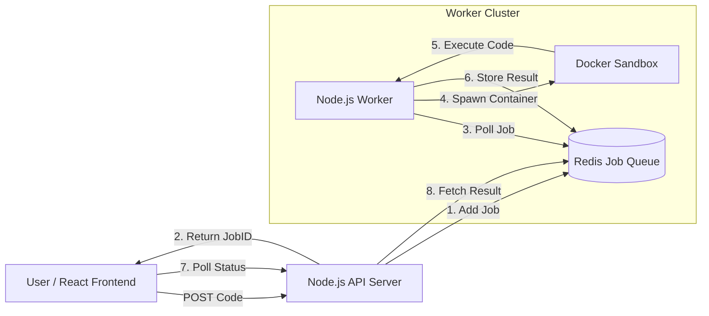

# CodeRunner - Distributed Remote Code Execution Engine 

CodeRunner is a scalable, asynchronous remote code execution engine capable of compiling and executing untrusted **C++** code securely. Built with a **Producer-Consumer architecture**, it leverages **Docker** for sandboxing, **Redis** for job queuing, and **Polling** for real-time status updates—replicating the core backend infrastructure of platforms like LeetCode.


---

## 🎥 Live Demo


https://github.com/user-attachments/assets/e53e65c9-bac0-4ff0-8741-de0ef7996905


> *Watch the demo to see real-time compilation, queue processing, and output streaming.*

---

## 🏗️ System Architecture

The system is designed to handle high concurrency without blocking the main server thread. It uses a **distributed worker pattern** to decouple the API from CPU-intensive compilation tasks.



### Key Design Decisions
- **Asynchronous Processing**: Uses BullMQ (Redis based queue) to handle burst traffic. If 100 users submit code simultaneously, the server queues requests instead of crashing under load.

- **Secure Sandboxing**: Every code submission runs inside an ephemeral Docker container. This ensures complete isolation—users cannot access the host filesystem or interfere with other processes.

- **Scalability**: The architecture allows horizontal scaling. You can spin up multiple "Worker" instances on different servers to handle more load without changing the code.

---
## 🛠️ Tech Stack
- **Frontend**: React, Vite, Monaco Editor (VS Code core), Axios

- **Backend**: Node.js, Express

- **Orchestration**: Docker, Docker Compose

- **Queue**: Redis, BullMQ

- **Languages Supported**: C++

---

## 🚀 How to Run Locally
Since the project uses a distributed architecture, you need to start the components in the following order:

#### 1. Clone the repository 
```bash
git clone https://github.com/Garuna-A/CodeRunner.git
```

#### 2. Start Redis 
You need a Redis instance running on port 6379. You can use Docker for this:
```bash
docker run -d -p 6379:6379 --name redis-stack redis
```
In the demo video, the instance was already created, it was started using docker.

#### 3. Start Backend (API & Worker)
```bash
cd coderunner/compiler-backend
npm install
node index.js
```
*The server will start on http://localhost:5000 and connect to Redis.*

#### 4. Start Frontend (React UI)
Open a new terminal in the ```compiler-frontend``` folder:
```bash
cd coderunner/compiler-frontend
npm install
npm run dev
```
*Open the link shown (usually http://localhost:5173) to use the app.*

--- 

## 📂 Project Structure
```bash
CodeRunner/
├── compiler-backend/       # Node.js API & Worker logic
│   ├── codes/              # Temp storage for code files
│   ├── Dockerfile          # Sandbox environment definition
│   ├── executeCpp.js       # Docker execution logic
│   ├── index.js            # REST API Endpoints
│   └── jobQueue.js         # Redis Producer/Consumer logic
│
├── compiler-frontend/      # React UI
│   ├── src/
│   └── ...
```
---

## 🔌 API Endpoints
#### 1. Run Code
**POST** ```/run``` Queues for job execution
```JSON
{
  "language": "cpp",
  "code": "#include <iostream>..."
}
```
**Response:**
```JSON
{
  "jobId": "uuid-v4-string",
  "status": "queued"
}
```

#### 2. Check Status
**GET** ```/status?id={jobId}``` Checks if the job is finished. Response (Success):
```JSON
{
  "success": true,
  "jobId": "...",
  "state": "completed",
  "output": "Hello World!"
}
```
---
***Made with ❤️ by [Anurag](https://github.com/Garuna-A/)***
